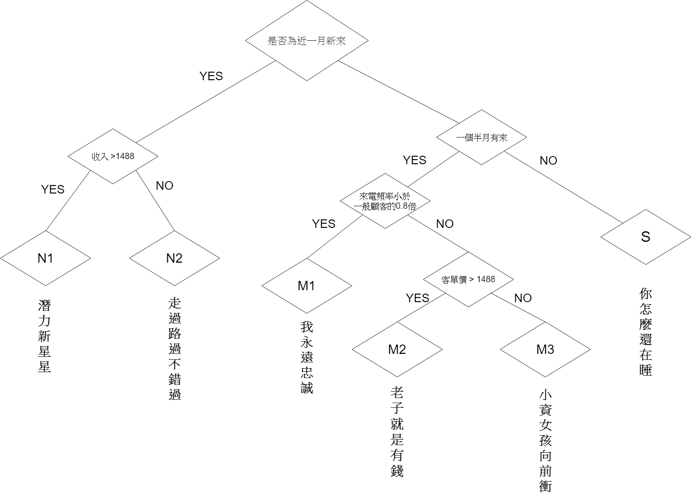

組員 : `張傳銘` `傅昶曄` `蔣佳伶` `黃柏融` `王澤恩`

<hr>

### Preparing The Predictors(X)
這邊用老師整理的資料集tf0,tf2。
```{r echo=T, message=F, cache=F, warning=F}
rm(list=ls(all=TRUE))
Sys.setlocale("LC_TIME","C")
pacman::p_load(magrittr, readr, caTools, ggplot2, dplyr,plotly,lubridate)
load("data/tf0.rdata")
load("data/tf2.rdata")
```

##### The Demarcation Date
將2001年2月的資料分割出來。
```{r}
feb01 = as.Date("2001-02-01")
Z = subset(Z0, date < feb01)    # 618212
```

##### Aggregate for the Transaction Records
```{r}
X = group_by(Z, tid) %>% summarise(
  date = first(date),  # 交易日期
  cust = first(cust),  # 顧客 ID
  age = first(age),    # 顧客 年齡級別
  area = first(area),  # 顧客 居住區別
  items = n(),                # 交易項目(總)數
  pieces = sum(qty),          # 產品(總)件數
  total = sum(price),         # 交易(總)金額
  gross = sum(price - cost)   # 毛利
  ) %>% data.frame  # 88387
```

```{r}
summary(X)
```

##### Check Quantile and Remove Outlier 
```{r}
sapply(X[,6:9], quantile, prob=c(.999, .9995, .9999))
```

```{r}
X = subset(X, items<=64 & pieces<=98 & total<=11260) # 88387 -> 88295
```


##### 分群規則

假設平均購買週期為30天(2K=30)
```{r}
# K = as.integer(sum(A0$s[A0$f>1]) / sum(A0$f[A0$f>1])); K
K=15
```
<b>（一）我們是如何分群的</b>？</br></br>
 我們先用三個參數(seniority,frequency,recency)把顧客分群，用ifelse條件式來將顧客區分潛力新星星(N1)、走過路過不錯過(N2)、我永遠忠誠(M1)、老子就是有錢(M2)、小資女孩向前衝(M3)、你怎麼還在睡(S)。</br></br>
<b>第一層</b></br>
首先使用了「第一次消費距今天數」來判斷是否為新顧客，將我們的客群分成了「N」以及「M」兩個部分。</br>

<b>第二層(左)</b></br>
使用了「頻率和客單價的乘積是否大於1400」來判斷是否為潛力顧客，把我們的顧客又分為「N1」和「N2」兩個部分。</br>

<b>第二層(右)</b></br>
是使用了「購買頻率是否大於12天」把此層可群又分成「M1」和「M2、M3」兩個部分。</br>
使用了「平均客單價是否大於1488」來做分群，分為「M2」以及「M3」兩群。

```{r}
STS = c("N1","N2","S","M1","M2","M3")
Status = function(rx,fx,mx,sx,K) {factor(
    ifelse(sx < 2*K,ifelse(fx*mx > 1400, "N1", "N2"),
         ifelse(rx < 3*K,
                ifelse(sx/fx < 0.8*K, "M1", 
                       ifelse(mx > 1488, "M2", "M3")),"S")    # mx*fx > 4752
                ), STS)}             # ifelse(sx/fx < 0.75*K,"R2","R1")
```



##### 將族群屬性整合
```{r}
d0 = max(X$date) + 1
A = X %>% mutate(
  days = as.integer(difftime(d0, date, units="days"))
  ) %>% 
  group_by(cust) %>% summarise(
    recent = min(days),           #   最後一次購買距期末天數   
    freq = n(),                   #   購買次數 (至期末為止)   
    money = mean(total),         #   平均購買金額 (至期末為止)
    senior = max(days),           #   第一次購買距期末天數
    rev = sum(total),   # total revenue contribution
    raw = sum(gross),   # total gross profit contribution
    age = age[1],       # age group
    area = area[1],     # area code
    status = Status(recent,freq,money,senior,K),  # 期末狀態
    date=date[1],
    month=date[1] %>% month()
  ) %>% data.frame      # 28584
nrow(A)
```

```{r}
table(A$status)
```

<br><br><hr>

##### 族群屬性動態分析
```{r}
CustSegments = A %>% 
  group_by(status) %>% summarise(
    average_frequency = mean(freq),
    average_cycle= mean(senior/freq),
    average_amount = mean(money),
    average_recency = mean(recent),
    average_seniority = mean(senior),
    average_rev = mean(rev),
    group_size = n()
    
  ) 
a <- CustSegments%>%  ggplot(aes(x=average_frequency, y=average_amount)) +
  geom_point(aes(size=average_seniority, col=average_rev),alpha=0.5) +
  scale_size(range=c(4,30)) +
  scale_color_gradient(low="blue",high="red") +
  scale_x_log10() + scale_y_log10(limits=c(30,3000)) + 
  geom_text(aes(label = status ),size=3) +
  theme_bw() + guides(size=F) +
  labs(title="Customer Segements",
       subtitle="(bubble_size:revenue_seniority_contribution; text:group_size)",
       color="Revenue") +
  xlab("Average Frequency ") + ylab("Average Amount ")

ggplotly(a)

```

```{r}
CustSegments <- CustSegments %>% mutate(dummy=2000)
```
```{r eval=F, results='asis', tidy=FALSE}
# op = options(gvis.plot.tag='chart')
m1 = gvisMotionChart(
  CustSegments, "status", "dummy",
  options=list(width=1280, height=720))
```

### Preparing the Target Variables (Y)

##### Aggregate Feb's Transaction by Customer
```{r}
feb = filter(X0, date>= feb01) %>% group_by(cust) %>% 
  summarise(amount = sum(total))  
```

##### The Target for Regression - `A$amount`
Simply a Left Joint
```{r}
A = merge(A, feb, by="cust", all.x=T)
```

##### The Target for Classification - `A$buy`
```{r}
A$buy = !is.na(A$amount)
```

##### Summary of the Dataset
```{r}
summary(A)
```

##### The Association of Categorial Predictors
```{r fig.height=3, fig.width=7.2}
tapply(A$buy, A$age, mean) %>% barplot
abline(h = mean(A$buy), col='red')
```

```{r fig.height=3, fig.width=7.2}
tapply(A$buy, A$area, mean) %>% barplot(las=2)
abline(h = mean(A$buy), col='red')
```
```{r}
tapply(A$buy, A$status, mean) %>% barplot(las=2)
abline(h = mean(A$buy), col='red')
```

##### Contest Dataset
```{r}
X = subset(X, cust %in% A$cust & date < as.Date("2001-02-01"))
Z = subset(Z, cust %in% A$cust & date < as.Date("2001-02-01"))
set.seed(2018); spl = sample.split(A$buy, SplitRatio=0.7)
c(nrow(A), sum(spl), sum(!spl))
```


##### Spliting for Classification 
```{r}
TR = subset(A, spl)
TS = subset(A, !spl)
```
<br><hr>

### Classification Model
```{r}
glm1 = glm(buy ~ ., TR[,c(2:10, 14)], family=binomial()) 
summary(glm1)
pred =  predict(glm1, TS, type="response")
cm = table(actual = TS$buy, predict = pred > 0.5); cm
acc.ts = cm %>% {sum(diag(.))/sum(.)}; acc.ts          # 0.69998
colAUC(pred, TS$buy)                                   # 0.7556
```
<br><hr>

### Regression Model
```{r}
A2 = subset(A, A$buy) %>% mutate_at(c("money","rev","amount"), log10)
TR2 = subset(A2, spl2)
TS2 = subset(A2, !spl2)
```

```{r}
lm1 = lm(amount ~ ., TR2[,c(2:6,8:10,13)])
summary(lm1)
```

```{r}
r2.tr = summary(lm1)$r.sq
SST = sum((TS2$amount - mean(TR2$amount))^ 2)
SSE = sum((predict(lm1, TS2) -  TS2$amount)^2)
r2.ts = 1 - (SSE/SST)
c(r2.tr, r2.ts)
```
<br><hr>

### Prediction
Aggregate data 2000-12-01 ~ 2001~02-28. 
```{r}
load("../unit15/data/tf0.rdata")
d0 = max(X0$date) + 1
B = X0 %>% 
  filter(date >= as.Date("2000-12-01")) %>% 
  mutate(days = as.integer(difftime(d0, date, units="days"))) %>% 
  group_by(cust) %>% summarise(
   recent = min(days),           #   最後一次購買距期末天數   
    freq = n(),                   #   購買次數 (至期末為止)   
    money = mean(total),         #   平均購買金額 (至期末為止)
    senior = max(days),           #   第一次購買距期末天數
    rev = sum(total),   # total revenue contribution
    raw = sum(gross),   # total gross profit contribution
    age = age[1],       # age group
    area = area[1],     # area code
    status = Status(recent,freq,money,senior,K),
    date=date[1],
    month=date[1] %>% month()
  ) %>% data.frame      # 28531
nrow(B)
```

In `B`, there is a record for each customer. `B$Buy` is the probability of buying in March.
```{r}
B$Buy = predict(glm1, B, type="response")
```

```{r}
B2 = B %>% mutate_at(c("money","rev"), log10)
B$Rev = 10^predict(lm1, B2)
```

```{r fig.height=2.4, fig.width=7.2}
par(mfrow=c(1,2), cex=0.8)
hist(B$Buy)
hist(log(B$Rev,10))
```

### CLV假設
```{r}
g = 0.5   # (稅前)獲利率
N = 1     # 期數 = 5
d = 0.1   # 利率 = 10%
B$CLV = g * B$Rev * rowSums(sapply(
  0:N, function(i) (B$Buy/(1+d))^i ) )

summary(B$CLV)
```

```{r fig.height=2.5, fig.width=7.2}
par(mar=c(2,2,3,1), cex=0.8)
hist(log(B$CLV,10), xlab="", ylab="")
```

### 各族群的平均營收貢獻、保留機率、終生價值
```{r}
Segments <- sapply(B[,13:15], tapply, B$status, mean)
Segments
```


### 設定行銷策略、規劃行銷工具
<hr>
<b>（一）潛力新星星(N1)</b></br>
1. 特徵：</br>
(1) 此類型顧客的客單價偏高、且創造的總利潤位於第二位。</br>
(2) 距離最近的消費日期是距今最短的，近期才做過第一次消費。</br>
2. 態度：</br>
(1) 認為此類型顧客尚無所謂忠誠度。</br>
(2) 可能屬於逛逛看、買買看的心態。</br>
(3) 我們認為此類型顧客所擁有的消費潛力非常高，必須用心經營，使其成為我們的忠誠顧客。</br>
3. 作法：</br>
(1) 分析此顧客群的主要購買產品，並定期研發其可能有興趣的新產品。</br>
(2) 可利用假期、爆買期推出節日相關產品，維持其好奇心。</br>
(3) 集點活動，這些顧客一開始的消費可能就可以讓他集到部分點數，而「差一點就集滿」的心態可能可以讓顧客願意再一次消費。</br>

<b>（二）走過路過不錯過(N2)</b></br>
1. 特徵：</br>
(1) 此類型顧客的客單價、人數都屬於中偏低的位置。</br>
(2) 距離最近的消費日期是距今最短的，近期才做過第一次消費。</br>
2. 態度：</br>
(1) 認為此類型顧客尚無所謂忠誠度。</br>
(2) 可能屬於逛逛看、買買看的心態。</br>
(3) 年度促銷活動時可能大量出現。</br>
3. 作法：</br>
(1) 可以在網路上投放廣告，使得這些新顧客時不時就會看見我們，並且在有需要的時候可以第一時間到我們的商店購物。 </br>
(2) 寄送定期E-mail讓此群顧客在看到促銷活動或是特惠時，可以來購買我們的產品。</br>

<b>（三）你怎麼還在睡(S)</b></br>
1. 特徵：</br>
此類型顧客的上一次消費日期距離現在非常久遠，且消費金額也不如其他類型高。</br>
2. 態度：</br>
我們會認為，此類型顧客對於我們的忠誠度不高、可能只是剛好路過，且對於我們所販售的產品需求也不大。因此，我們採取的態度是「能留最好，不留也罷」。</br>
3. 作法：</br>
每個檔期寄送E-mail。因為寄送E-mail不需要成本，且只要顧客有來過一次、留過資料，就可以使用此方法。</br>
 
<b>（四）我永遠忠誠(M1)</b></br>
1. 特徵：</br>
(1) 為消費頻率最高的族群</br>
(2) 雖然客單價並非最高，但因為頻率高，所達成的收益也有一定金額。</br>
2. 態度：</br>
(1) 我們認為此客群的忠誠度是為最高的其中一個。</br>
(2) 由於非常常到我們的店內做逛街，因此對於我們的商品可能非常了解。</br>
3. 作法：</br>
(1) 可以定期打電話或是寄信詢問此群顧客對於我們的產品、服務有什麼樣的建議，可以使這群顧客感受到自己是被重視的，且會使其產生更強的歸屬感。</br>
(2) 愈是忠誠的顧客在產品品質出問題時，喊的就愈大聲。因此我們必須要有強大的售後服務系統，在顧客一發出抱怨時，就要立刻處理、完成其需求。</br>
 
<b>（五）BELLAVITA / 老子就是有錢(M2)</b></br>
1. 特徵：</br>
(1) 消費頻率屬於中偏低，並不是最高的。</br>
(2) 平均客單價最高的族群，因此所創造的營收也很可觀。</br>
2. 態度：</br>
我們會認為，此類型顧客在選擇商品時，最重要的考慮點可能不是「價格」，而是商品的品質或是售後服務。</br>
3. 作法：</br>
(1) 針對商品的品質做行銷點。（可以將我們的商品分為「省錢專區」以及「品質最保證」等區域，以符合不同消費者的需求）</br>
(2) VIP制度：消費滿一定金額，且每年都有消費者，可獲得專屬生日好禮、新品優先購買資格。</br>
(3) 售後服務的部分：</br>
a. 在消費後一週內可以主動與消費者聯絡，關心其產品使用狀況，並詢問是否需要協助或需要改善之處。</br>
b. 定期寄送簡訊或是E-mail、打電話給予生日祝福、年節祝福，使顧客感覺自己是被重視的、是特別的。</br>
c. 拉攏新會員給優惠，物以類聚的概念，有錢人拉進來也是有錢人。</br>
 
<b>（六）小資女孩向前衝(M3)</b></br>
1. 特徵：</br>
(1) 所造成的總營收並非最高、消費頻率也非最多。</br>
(2) 人數龐大，僅次於沈睡顧客。</br>
2. 態度：</br>
(1) 雖然營收並非最高，但消費頻率屬於中偏高，且人數非常多。因此我們不能放棄此客群，若每一個顧客的客單價都能夠增加一點點，對於營收的幫助非常龐大。</br>
(2) 希望能夠讓這些顧客往「M1」前進，雖然單次消費價格無法達到像「M2」一樣多，但增加其購買頻率或是購買金額也能夠對營收有幫助。</br>
3. 作法：</br>
(1) 集點活動</br>
(2) 買大送小</br>
(3) 加一元多一件</br>

### 選擇行銷對象
```{r}
Segments
```
<b>「小資女孩向前衝M3」</b></br>
M3的消費習慣屬於不常來店消費、消費金額也不高的族群，從這兩點來看可以得知小資女孩</br>們的顧客忠誠度還有很大的進步空間，如果透過行銷活動的操作，藉此激發小資女孩們的</br>顧客潛能，使他們成為消費金額高又或者是來店頻率高的族群，來達到提升該族群的收入的效果。</br></br>

<b>「潛力新星星N1」</b></br>
N1是屬於客單價較高的族群，但回購率不高，若能留住他們，提高其忠誠度，使其轉化為M1~3，為公司帶來"持續性"的收益。


我們所選擇的客群有以下兩個客群：</br></br>
<b>（一）小資女孩向前衝(M3)</b></br>
依據以上的分析，我們認為要讓這一群顧客發揮最大的價值，只要讓每一個人的平均消費金額上升，就可以達成我們的目標。因此可能可以有以下幾項作法：</br></br>
<b>1.集點活動</b></br>
類似7-11、全聯的集點活動，以提高客單價。
（假如滿77元可以得到一點，那你現在消費75元，你就可能會多花錢來達到集點的價格。）</br></br>
<b>2.買大送小</b></br>
可以把一些「利潤較高」的產品和一些原本賣的比較好的低利潤、低價格產品綁在一起賣，讓這些「利潤較高」的產品銷量提高。</br>
（例如：在家電行內吹風機較好賣，但毛利較低，而大烤箱較難賣出，但毛利非常高。這時候就可以推出「買大烤箱送吹風機」活動，讓顧客感覺「賺到」，進而去使用我們的這個方案）</br></br>
<b>3.滿額贈</b></br>
類似集點活動的概念，也是希望可以提高顧客的客單價。</br>
（例如：百貨公司週年慶時會推出滿千送百活動，假設你購物滿950，就會想辦法去讓消費達到1000元。）</br></br>
<b>4.加價購</b></br>
其實也是要提高該族群的客單價，像是屈臣氏，你本來只要購買某項特定產品，但在結帳時店員都會詢問你「需不需要加購後方商品」，會讓人覺得「啊！好像很划算」，所以就會多買東西回家。</br></br>
<b>5.邀請好友搶優惠</b>
「邀請條碼」介紹新會員，這些小資族群對於價格彈性很高，給他們一點價格優惠就會激動得哇哇叫，因此透過介紹用戶進來就送折扣優惠可以達成族群壯大的目的。</br>

<b>（二）超級新星星(N1)</b></br>
根據以上的分析，我們認為要讓這個客群發揮其最大價值，是要讓這群「消費客單價高」的顧客「下一次」能夠再來消費，保留下這些潛力顧客。</br>
<b>1.滿額辦會員卡</b></br>
	顧客每次消費滿200元即可獲得一點，顧客在集滿十點之後，即可獲得VIP會員卡一張。顧客在獲得VIP會員卡之後，只要憑卡來店消費即可享有9折的優惠，生日當天來店消費滿2000就送500現金抵用券。</br></br>
<b>2.新手專屬優惠</b></br>
	第一次消費過後可獲得專屬新手禮券、折價券，並限定在30天內用完，促使消費者在30天內會再來消費。</br></br>
<b>3.消費一週後電訪了解是否有建議、了解顧客感受</b></br>


### 直接依假設估計淨期望報償

因為沒有成本資料，我們先假設營業獲利率為0.3
```{r}
MRG = 0.3
```

以`M3`為行銷對象
```{r}
C = subset(B, status=="M3")
P0=C$Buy
R0=C$Rev 
```

##### 假設一：固定成本、固定回購機率($k_1$)
```{r}
cost = 5
k1 = 0.75 # fix effect on the probability of retaintion
```

+ $\Delta P_{ret} = max[0, k_1 - P_{retain}]$
```{r fig.height=2.4, fig.width=7.2}
par(mar=c(4,3,3,2), cex=0.8)
PI = R0*MRG*pmax(0, k1 - P0) - cost
hist(PI, xlim=c(-50, 50), breaks=seq(-500,500,5),main="淨期望報償分布(M3)")
```

##### 假設二：固定成本、增加回購機率($k_2$)

$$\Delta P_{ret} = \left\{\begin{matrix}
k_2 & P_{retain}<=1-k_2 \\ 
1-P_{retain} & else 
\end{matrix}\right.$$

```{r fig.height=2.4, fig.width=7.2}
k2 = 0.3  # max. incremental effect of instrument
cost = 5
par(mar=c(4,3,3,2), cex=0.8)
PI = MRG * R0 * ifelse(P0<=(1-k2), k2, 1-P0) - cost
hist(PI, xlim=c(0, 100), breaks=seq(-500,500,5),main="淨期望報償分布(M3)")
```


##### 計算工具在各族群的效益
```{r}
B = B %>% mutate(
  PI = MRG*Rev*ifelse(Buy<=(1-k2), k2, 1-Buy) - cost
  ) 
B %>% group_by(status) %>% 
  summarise(
    Group.Sz = n(),
    No.Target = sum(PI>0),
    AvgROI = mean(PI[PI>0]),
    TotalROI = sum(PI[PI>0])) %>% 
  arrange(No.Target) %>% 
  data.frame
```

##### 工具在各族群的淨期望報償分布
```{r fig.height=8, fig.width=7}

par(mfrow=c(4,2), mar=c(4,3,3,2), cex=0.8)
for(s in c("N1","N2","S","M1","M2","M3")) {
  hist(B$PI[B$status==s], xlim=c(-5, 100), breaks=seq(-1000,1000,10), 
       ylim=c(0, 1500), main=s, xlab="exp.profit")
  abline(v=0, col='green', lty=2)}
```

### 模擬成本與效果的關係

##### 帶有參數的函數
```{r}
m=0.20; a=20; b=15
curve(m*plogis((10/a)*(x-b)), 0, 30, lwd=2, ylim=c(0, 0.25),
      main=c('m*Logis(10(x - b)/a)'), ylab="f(x)")
abline(h=seq(0,0.2,0.05),v=seq(0,30,5),col='lightgrey',lty=2)
```

##### 使用模擬方法找到最佳策略(參數)
```{r}
m=0.20; a=20; b=15
do.call(rbind, lapply(seq(5,40,0.5), function(c){
  p = m*plogis((10/a)*(c-b))
  B %>% mutate(
    PI = ifelse(Buy<=(1-p), p, 1-Buy) * Rev - c
  ) %>%
    group_by(status) %>% summarise(
      Cost = c,
      Group.Sz = n(),
      No.Target = sum(PI>0),
      AvgROI = mean(PI[PI>0]),
      TotalROI = sum(PI[PI>0])
    ) } ) ) %>% 
  ggplot(aes(x=Cost, y=TotalROI, col=status)) +
  geom_line(size=1.2) +
  ggtitle("Cost Effeciency per Segment ")
```

由上方行銷模擬工具圖可以得知，總收益會隨著成本的投入而逐漸升高，至一定成本後邊際收益會遞減，當成本控制在20幾時，小資族會是帶來最高收益的族群，容易受到行銷活動的誘發，帶來更高效益，且可以發現這項工具用在M3會有最大的效益。


```{r eval=F}
manipulate({
  do.call(rbind, lapply(seq(5,40,0.5), function(c){
    p = m*plogis((10/a)*(c-b))
    B %>% mutate(
      PI = ifelse(Buy<=(1-p), p, 1-Buy) * Rev - c
    ) %>%
      group_by(status) %>% summarise(
        Cost = c,
        Group.Sz = n(),
        No.Target = sum(PI>0),
        AvgROI = mean(PI[PI>0]),
        TotalROI = sum(PI[PI>0])
      ) } ) ) %>% 
    ggplot(aes(x=Cost, y=TotalROI, col=status)) +
    geom_line(size=1.2) +
    ggtitle("Cost Effeciency per Segment ")
},
m = slider(0.05, 0.25,  0.20, step=0.01),
a = slider(  10,   30,    20, step=1),
b = slider(   4,   20,    15, step=1)
) 
```
<br><br><hr>

